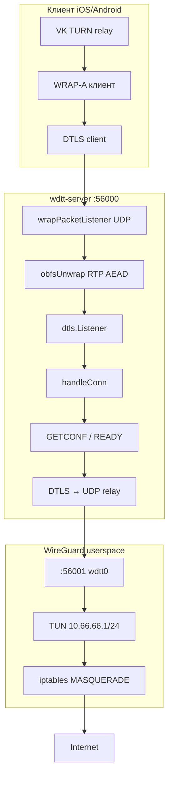

# WDTT Server — полный разбор

Документ описывает монолит `wdtt-server` (`server.go` + `devices.go` + `speedlimit.go`).

**Резервная копия исходника (не трогать для экспериментов):**  
`/root/wdtt/server.go.backup-20260609` — снимок `server.go` от 2026-06-09.

---

## 1. Назначение

WDTT Server — VPN-бэкенд для схемы **VK TURN → WRAP → DTLS → WireGuard**:

```
[iPhone / Android клиент]
    │  TURN (VK 95.163.x.x:19302) — вне сервера
    ▼
[UDP :56000] WRAP (RTP AEAD) → DTLS 1.2 → GETCONF → WG relay
    ▼
[127.0.0.1:56001] userspace WireGuard (wdtt0, 10.66.66.0/24)
    ▼
[NAT MASQUERADE] → интернет
```

Сервер **не** получает TURN-трафик напрямую: клиент строит relay до VK, через relay шлёт DTLS на `:56000`.

---

## 2. Файлы и роли

| Файл | Строк ~ | За что отвечает |
|------|---------|-----------------|
| `server.go` | 2240 | Основной бинарник: DTLS, WRAP, WG, БД, Telegram-бот, NAT, статистика |
| `devices.go` | 150 | Привязка `device_id` к паролям, лимит устройств на пароль |
| `speedlimit.go` | 175 | `tc` HTB — лимиты скорости по IP клиента в подсети WG |

Конфиг на диске (`/etc/wdtt/`):

| Файл | Назначение |
|------|------------|
| `panel.db` | **Primary:** SQLite — панель, users, inbound, xray (schema v4) |
| `passwords.json` | Dual-write backup: пароли, устройства, трафик |
| `inbound.json` | Dual-write backup: DNS, MTU, `max_users`, таймауты |
| `wg-keys.dat` | Серверные/legacy WG ключи (4 строки base64) |
| `server.log` | JSON-снимок статистики для панели (каждые 10 с) |

---

## 3. Архитектура (потоки)



---

## 4. Константы и порты

```go
wgIfaceName           = "wdtt0"
wgServerAddr          = "10.66.66.1"
wgServerCIDR          = "10.66.66.0/24"
defaultInternalWGPort = 56001   // WG UDP внутри хоста
default listen        = 0.0.0.0:56000  // DTLS снаружи
wgMTU                 = 1280
keepalive             = 25
userIdleTimeout       = 90s     // «онлайн» в статистике
```

CLI-флаги `main()`:

| Флаг | Default | Описание |
|------|---------|----------|
| `-listen` | `0.0.0.0:56000` | DTLS + WRAP снаружи |
| `-wg-port` | `56001` | WG userspace bind |
| `-config-dir` | `/etc/wdtt` | БД и ключи |
| `-password` | — | Главный пароль (WRAP + GETCONF) |
| `-admin` | — | Telegram admin ID |
| `-bot-token` | — | Telegram bot token |

---

## 5. Разбор `server.go` по блокам

### 5.1 База данных (`Database`, `initDB`, `saveDB`)

**Структуры:**

- `ClientDevice` — `device_id`, IP в `10.66.66.x`, WG keypair клиента.
- `PasswordEntry` — сгенерированный пароль: срок, трафик, лимиты скорости, VK hash, порты для deep-link, деактивация, список `device_ids`.
- `Database` — `main_password`, Telegram, maps `passwords` / `devices`.

**Логика:**

- `initDB` — загрузка users из `panel.db` (fallback `passwords.json`), миграция устройств, запись CLI-пароля, `refreshWrapKeysFromDBLocked`.
- `saveDB` — dual-write: SQLite + `passwords.json` (`0600`), вызывается часто под `dbMutex`.
- `isPasswordExpired` / `isTrafficExceeded` — проверки доступа.
- `addTrafficLocked` — учёт up/down, при превышении `TotalBytes` возвращает `false` → разрыв сессии.

### 5.2 WRAP / obfs (`wrapKeyStore`, `obfsWrapPacket`, `listenWrapped`)

**Идея:** UDP-пакеты до DTLS выглядят как **RTP** (WebRTC), внутри ChaCha20-Poly1305.

**Ключ:** HKDF-SHA256 от пароля:

```
IKM = password
salt = "WDTT-WRAP-v1"
info = "rtp-obfs/chacha20poly1305"
→ 32 байта
```

**На сервере** несколько ключей: `main` + по одному на каждый активный пароль (`pass:<hash>`).  
`Unwrap` перебирает ключи до успешной расшифровки.

**Слои:**

1. `listenWrapped` — UDP `:56000`, оборачивает в `wrapPacketConn`.
2. `wrapPacketConn.ReadFrom` — unwrap RTP → сырой DTLS payload в pion.
3. `wrapPacketConn.WriteTo` — wrap ответ DTLS → RTP наружу.

Логи: `[WRAP] OK`, `[WRAP] Отказ: RTP AEAD auth failed`.

### 5.3 DTLS (`main`, pion/dtls v3)

После unwrap — стандартный DTLS listener:

- Self-signed cert
- Extended Master Secret (required)
- Cipher: `TLS_ECDHE_ECDSA_WITH_AES_128_GCM_SHA256`
- Connection ID: random 8 bytes (NAT traversal)

Каждое входящее соединение → goroutine `handleConn`.

### 5.4 `handleConn` — сердце протокола

**Фаза 1 — Handshake (30 s):**

```go
dtlsConn.HandshakeContext(hctx)
```

При ошибке: `[DTLS] Handshake failed from <addr>: <err>`.

**Фаза 2 — Первый datagram (30 s read deadline):**

| Первое сообщение | Действие |
|------------------|----------|
| `GETCONF:<port>\|<device_id>\|<password>` | Выдача WG-конфига или DENIED |
| (после GETCONF) `READY` | Handshake клиента, ответ `READY_OK` |
| WG packet | Сразу relay (legacy / без GETCONF) |

**GETCONF ответы:**

| Ответ | Значение |
|-------|----------|
| `[Interface]...` (текст WG ini) | OK, peer добавлен в WG |
| `DENIED:wrong_password` | Неверный пароль |
| `DENIED:expired` | Истёк срок |
| `DENIED:traffic_exceeded` | Лимит байт |
| `DENIED:deactivated` | Пароль отключён |
| `DENIED:device_mismatch` | Лимит устройств |
| `NOCONF` | Не удалось выделить IP/ключи |

Клиентский конфиг: `Endpoint = 127.0.0.1:<port>` — WG внутри клиента ходит в локальный порт прокси.

**Фаза 3 — Relay DTLS ↔ `127.0.0.1:wg-port`:**

- Два goroutine: client→WG, WG→client.
- Idle deadline: **30 минут** на read.
- DTLS keepalive: пакет `0xFF` (1 байт) игнорируется.
- Учёт трафика по паролю, `userTouchActivity`.
- При старте relay: `userSessionEnter` → лог `[ПОДКЛ]`.

### 5.5 WireGuard userspace (`startUserspaceWG`)

- TUN `wdtt0`, MTU 1280.
- `wireguard-go` device + default bind на `:56001`.
- Peers из `db.Devices` при старте + `upsertPeerInWG` при GETCONF.
- UAPI socket для `wg` CLI.
- `configureInterface` — `10.66.66.1/24`, link up.

### 5.6 NAT (`setupFullConeNAT`)

- `ip_forward=1`
- FORWARD accept для `wdtt0` (iptables `-I 1`, до UFW)
- MASQUERADE для `10.66.66.0/24` на внешний интерфейс
- Fallback: nftables
- `natType` в статистике

### 5.7 Telegram-бот (`botLoop`)

Long-polling `getUpdates`. Команды:

- `/start`, `/new`, `/list`
- Создание паролей (срок, порты, VK hash)
- Inline-кнопки: просмотр, деактивация, удаление, лимиты
- `buildPublicWdttLink` — deep link для клиента

Бот работает в отдельной goroutine, все изменения БД → `refreshWrapKeys` / `saveDB`.

### 5.8 Статистика и presence

| Переменная | Смысл |
|------------|--------|
| `activeConns` | Открытые DTLS-сессии (после handshake) |
| `activeUsers` | Уникальные device_id с активностью < 90 s |
| `totalConns` | Всего accept с старта |
| `totalBytesFromClient` / `ToClient` | Суммарный relay |

`statsLoop` каждые 10 s:

- Лог `[СТАТ] Пользователей | Сессий | NAT | ↑↓ МБ`
- Запись `/etc/wdtt/server.log` (JSON для панели)
- Периодический `saveDB` если `trafficDirty`

### 5.9 Прочее

- `enableBBR` — sysctl TCP BBR при старте.
- `expiredPasswordJanitor` — снятие peers истёкших паролей.
- `bufPool` — пул буферов 1600 B для relay.
- `getPublicIP` — ipify для ссылок в боте.

---

## 6. `devices.go`

- `entryMaxDevices` — по умолчанию 1 устройство на пароль (макс. 20).
- `entryCanAcceptDevice` / `bindDeviceToEntry` — при GETCONF новый `device_id` привязывается к паролю.
- `allEntryDeviceIDs` — для массового удаления peers при деактивации.

---

## 7. `speedlimit.go`

Per-IP shaping на интерфейсе `wdtt0` через `tc` HTB:

- `MaxDownMBps` / `MaxUpMBps` в `PasswordEntry`
- `applySpeedLimitForEntryUnlocked` после успешного GETCONF
- Download: root qdisc, class по последнему октету IP
- Upload: ingress policer

Если `tc` нет — предупреждение в лог, VPN работает без лимита.

---

## 8. Протокол клиента (WRAP-A / amurcanov / iOS)

Ожидаемая последовательность:

1. TURN allocate (VK, на клиенте).
2. DTLS connect на `peer_addr` (ваш `:56000`), внутри каждого UDP — WRAP RTP.
3. Первый DTLS app data: `GETCONF:9000|{device_id}|{wrap_password}`.
4. Ответ — текст WG config.
5. Клиент: `READY` → `READY_OK`.
6. Клиент шлёт WG handshake packets через тот же DTLS.
7. Дальше bidirectional WG в DTLS.

Пароль в GETCONF = `wrap_a_password` в iOS (`ildar` и т.д.), не VK TURN password.

---

## 9. Сравнение с [cacggghp/vk-turn-proxy](https://github.com/cacggghp/vk-turn-proxy)

| | vk-turn-proxy server | wdtt-server |
|--|---------------------|-------------|
| DTLS :56000 | ✓ | ✓ |
| WRAP obfs | ✗ | ✓ |
| GETCONF multi-user | ✗ | ✓ |
| Встроенный WG | relay на внешний WG | userspace WG + NAT |
| Telegram / лимиты | ✗ | ✓ |
| VLESS/KCP mode | ✓ | ✗ |

---

## 10. Логи — шпаргалка

| Префикс | Когда |
|---------|--------|
| `[WRAP]` | RTP unwrap/wrap, выбор ключа |
| `[DTLS]` | Handshake fail |
| `[WG]` | GETCONF, новые устройства, отказы |
| `[ПОДКЛ]` | Начало relay-сессии (успешный VPN) |
| `[СТАТ]` | Каждые 10 s |
| `[NAT]` | Настройка MASQUERADE |
| `[TC]` | Лимиты скорости |

Просмотр: `journalctl -u wdtt -f`

---

## 11. Идеи улучшений (не внедрены — только предложения)

Работать с копией: `server.go.backup-20260609` или отдельная ветка.

### 11.1 Диагностика (низкий риск)

| # | Идея | Зачем |
|---|------|-------|
| 1 | Логировать fail **первого Read** после handshake (`NOCONF`, timeout) | Сейчас silent `return` — сложно отличить getconf timeout от обрыва TURN |
| 2 | Лог `[WG] GETCONF OK` с `device_id`, IP, RTT не нужен — уже есть `[ПОДКЛ]` | Явная связка до relay |
| 3 | Счётчики prometheus/textfile: `dtls_handshake_fail_total`, `wrap_auth_fail_total` | Мониторинг с работы |
| 4 | Флаг `-handshake-timeout` (default 30s) | На плохих сетях клиента иногда нужно больше |

### 11.2 Надёжность

| # | Идея | Зачем |
|---|------|-------|
| 5 | Graceful shutdown: дождаться `wg.Wait()` в main, не `os.Exit` сразу | Чище рестарты systemd |
| 6 | Проверять ошибку `saveDB()` / fsync | Сейчас `_` игнорирует сбой диска |
| 7 | Лимит одновременных DTLS на один `device_id` | Защита от 10 conn iOS на один слот |
| 8 | Reuse UDP socket к WG (`Dial` на каждую сессию) | Меньше fd; нужно аккуратно с demux |

### 11.3 Производительность

| # | Идея | Зачем |
|---|------|-------|
| 9 | SO_REUSEPORT на WRAP UDP listener | Несколько процессов/ядер (осторожно с state) |
| 10 | Увеличить WRAP demux buffer (`SetReadBuffer` на inner UDP) | Burst от TURN |
| 11 | Опционально отключить `trafficDirty` save каждые 10s на больших нагрузках | Меньше I/O |

### 11.4 Функциональность

| # | Идея | Зачем |
|---|------|-------|
| 12 | **VLESS mode** (как vk-turn-proxy `-vless`) | Альтернатива WG через Xray |
| 13 | HTTP `/health` на localhost для панели | Быстрый probe «server alive» |
| 14 | Экспорт списка VK IP для split-tunnel подсказок | Документация для клиентов |
| 15 | Per-password custom `-listen` port из `PasswordEntry.Ports` | Уже частично в боте для deep link, не в runtime |

### 11.5 Безопасность

| # | Идея | Зачем |
|---|------|-------|
| 16 | Rate-limit GETCONF fail по IP (in-memory) | Brute force пароля через TURN |
| 17 | Ротация WRAP ключей без restart (уже есть Add/Remove) | OK |
| 18 | Не логировать полные DENIED с device_id на debug только | Privacy |

### 11.6 Приоритет для вашего сценария (корп. Wi‑Fi + iOS)

1. **#1, #4** — лучше видеть `getconf dtls timeout` vs `handshake fail`.
2. **#7** — iOS с `num_conns=10` создаёт много параллельных DTLS; часть падает на работе.
3. **#16** — опционально, если будут атаки на `:56000`.

---

## 12. Сборка и деплой

```bash
cd /root/wdtt
go build -o /usr/local/bin/wdtt-server .
systemctl restart wdtt
systemctl status wdtt
```

Проверка после изменений:

```bash
journalctl -u wdtt -f | grep -E 'DTLS|WRAP|ПОДКЛ|WG|СТАТ'
```

---

## 13. Связанные репозитории

- iOS клиент: `anton48/vk-turn-proxy-ios` (WRAP-A, cred pool)
- Референс протокола: `cacggghp/vk-turn-proxy`
- Панель: `wdtt/panel/` — читает `server.log`, users/inbound из `panel.db` (dual-write JSON)
- Probe TURN: `wdtt/tools/vk_turn_probe/`
