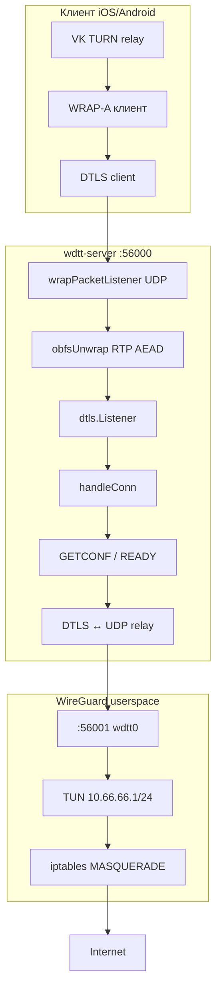

# WDTT Server — полный разбор

Документ описывает бинарник `wdtt-server` — Go-модуль `server/` (~4300 строк в 18 файлах).
Общая SQLite-логика с панелью вынесена в `pkg/paneldb/`.

---

## 0. Структура репозитория

```
wdtt/
├── pkg/                 # общие пакеты (server + panel)
│   ├── paneldb/         # SQLite: users, devices, inbound, panel_config, xray_*
│   ├── sharelink/       # wdtt:// encode/decode
│   └── vkhash/          # парсинг VK hash для deep link
├── server/              # wdtt-server (go.mod: wdtt-server)
│   ├── server.go        # main, Database, initDB, NAT, stats loop
│   ├── server_wrap.go   # WRAP / RTP AEAD obfs
│   ├── server_conn.go   # handleConn, GETCONF, relay
│   ├── server_wg.go     # userspace WireGuard
│   ├── server_bot.go    # Telegram-бот
│   ├── server_stats.go  # statsLoop, server.log
│   ├── server_presence.go
│   ├── panel_db.go      # чтение panel.db через paneldb
│   └── …                # devices, speedlimit, relay_*, admin
├── panel/               # wdtt-panel (веб-UI + API)
├── build.sh             # go build ./server [./panel]
├── go.work              # корень + server/ + panel/
└── deploy.sh            # установщик VPS
```

Сборка:

```bash
./build.sh amd64              # только server → wdtt-server-linux-amd64
./build.sh amd64 panel          # только panel → wdtt-panel-linux-amd64
./build.sh amd64 all            # оба бинарника
./panel/build.sh /usr/local/bin/wdtt-panel   # установка на сервер
```

Или вручную: `go build -o wdtt-server ./server`, `cd panel && go build .`

---

## 1. Назначение

WDTT Server — VPN-бэкенд для схемы **VK TURN → WRAP → DTLS → WireGuard**:

```
[iPhone / Android клиент]
    │  TURN (VK 95.163.x.x:19302) — вне сервера
    ▼
[UDP :56000] WRAP (RTP AEAD) → DTLS 1.2 → GETCONF → WG relay
    ▼
[127.0.0.1:56001] userspace WireGuard (wdtt0, 10.66.66.0/24)
    ▼
[NAT MASQUERADE] → интернет
```

Сервер **не** получает TURN-трафик напрямую: клиент строит relay до VK, через relay шлёт DTLS на `:56000`.

---

## 2. Файлы и роли

### 2.1 `server/` — исходники wdtt-server

| Файл | Строк ~ | За что отвечает |
|------|---------|-----------------|
| `server.go` | 550 | `main`, типы `Database` / `PasswordEntry`, `initDB`, NAT, expired janitor |
| `server_wrap.go` | 450 | WRAP key store, RTP AEAD wrap/unwrap, `listenWrapped` |
| `server_conn.go` | 420 | `handleConn`: DTLS handshake, GETCONF, READY, relay DTLS↔WG |
| `server_wg.go` | 590 | userspace WireGuard (TUN `wdtt0`, peers, UAPI) |
| `server_bot.go` | 600 | Telegram long-poll, команды, deep links |
| `server_presence.go` | 350 | online/idle пользователей, `userTouchActivity` |
| `server_stats.go` | 115 | `statsLoop`, запись `server.log` |
| `server_util.go` | 75 | утилиты (публичный IP, BBR, buf pool) |
| `panel_db.go` | 200 | SQLite `panel.db` через `pkg/paneldb` |
| `paneldb_store.go` | 135 | адаптеры Database ↔ paneldb.Store |
| `devices.go` | 155 | лимит устройств на пароль, bind device_id |
| `speedlimit.go` | 175 | `tc` HTB — лимиты скорости по IP в WG |
| `relay_sessions.go` | 118 | учёт relay-сессий, эвикция idle > 3 мин |
| `relay_fail.go` | 103 | fast-fail «мёртвых» VK TURN relay |
| `admin.go` | 116 | localhost HTTP: `/health`, `POST /admin/reload` |
| `getconf_ratelimit.go` | 67 | rate-limit неудачных GETCONF |
| `dtls_cert.go` | 83 | self-signed cert для DTLS |
| `wdtt_share.go` | 24 | обёртка над `pkg/sharelink` |

### 2.2 Конфиг на диске (`/etc/wdtt/`)

| Файл | Назначение |
|------|------------|
| `panel.db` | **Primary:** SQLite — панель + VPN-данные (schema v9). Таблицы: `panel_config`, `wdtt_*`, `xray_*` |
| `wg-keys.dat` | Серверные/legacy WG ключи (4 строки base64) |
| `server.log` | JSON-снимок статистики для панели (каждые 10 с) |

Legacy JSON (`passwords.json`, `inbound.json`, `panel.json`) импортируется **панелью** при первом старте и удаляется. Сервер читает только `panel.db`.

### 2.3 `pkg/paneldb` — что читает сервер

| API | Таблица | Назначение |
|-----|---------|------------|
| `LoadStore` / `SaveStore` | `wdtt_users`, `wdtt_devices`, `wdtt_global` | пользователи и устройства |
| `LoadRuntimeSettings` | `wdtt_inbound` | DNS, MTU, max_users, timeouts |
| `LoadPanelServicePorts` | `panel_config` | порты панели и subscription (iptables) |
| `UpdateLastSeen` | `wdtt_users` | last_seen_at при активности |

Xray-таблицы (`xray_config`, …) сервер **не** читает — только панель.

## 3. Архитектура (потоки)



---

## 4. Константы и порты

```go
wgIfaceName           = "wdtt0"
wgServerAddr          = "10.66.66.1"
wgServerCIDR          = "10.66.66.0/24"
defaultInternalWGPort = 56001   // WG UDP внутри хоста
default listen        = 0.0.0.0:56000  // DTLS снаружи
wgMTU                 = 1280
keepalive             = 25
userIdleTimeout       = 90s     // «онлайн» в статистике
```

CLI-флаги `main()`:

| Флаг | Default | Описание |
|------|---------|----------|
| `-listen` | `0.0.0.0:56000` | DTLS + WRAP снаружи |
| `-wg-port` | `56001` | WG userspace bind |
| `-config-dir` | `/etc/wdtt` | БД и ключи |
| `-password` | — | Главный пароль (WRAP + GETCONF) |
| `-admin` | — | Telegram admin ID |
| `-bot-token` | — | Telegram bot token |
| `-handshake-timeout` | `30s` | Базовый таймаут DTLS handshake |
| `-admin-addr` | `127.0.0.1:2861` | Localhost HTTP: `/health`, `POST /admin/reload` |
| `-max-dtls-per-device` | `0` | Лимит параллельных GETCONF на `device_id` (0 = без лимита) |

---

## 5. Разбор `server/` по блокам

| Блок | Файл(ы) |
|------|---------|
| БД, save/load | `server.go`, `panel_db.go`, `paneldb_store.go` |
| WRAP / obfs | `server_wrap.go` |
| DTLS + GETCONF + relay | `server_conn.go`, `dtls_cert.go` |
| WireGuard | `server_wg.go` |
| Telegram | `server_bot.go`, `wdtt_share.go` |
| Статистика / presence | `server_stats.go`, `server_presence.go` |
| Admin HTTP | `admin.go` |
| Relay lifecycle | `relay_sessions.go`, `relay_fail.go` |
| NAT, main loop | `server.go`, `server_util.go` |

### 5.1 База данных (`Database`, `initDB`, `saveDB`)

**Структуры:**

- `ClientDevice` — `device_id`, IP в `10.66.66.x`, WG keypair клиента.
- `PasswordEntry` — сгенерированный пароль: срок, трафик, лимиты скорости, VK hash, порты для deep-link, деактивация, список `device_ids`.
- `Database` — `main_password`, Telegram, maps `passwords` / `devices`.

**Логика:**

- `initDB` — загрузка users из `panel.db` через `paneldb.LoadStore` (пустая БД → пустые users).
- `saveDB` — `paneldb.SaveStore` (PreserveSubIDs), под `dbMutex`.
- `isPasswordExpired` / `isTrafficExceeded` — проверки доступа.
- `addTrafficLocked` — учёт up/down, при превышении `TotalBytes` возвращает `false` → разрыв сессии.

### 5.2 WRAP / obfs (`server_wrap.go`)

**Идея:** UDP-пакеты до DTLS выглядят как **RTP** (WebRTC), внутри ChaCha20-Poly1305.

**Ключ:** HKDF-SHA256 от пароля:

```
IKM = password
salt = "WDTT-WRAP-v1"
info = "rtp-obfs/chacha20poly1305"
→ 32 байта
```

**На сервере** несколько ключей: `main` + по одному на каждый активный пароль (`pass:<hash>`).  
`Unwrap` перебирает ключи до успешной расшифровки.

**Слои:**

1. `listenWrapped` — UDP `:56000`, оборачивает в `wrapPacketConn`.
2. `wrapPacketConn.ReadFrom` — unwrap RTP → сырой DTLS payload в pion.
3. `wrapPacketConn.WriteTo` — wrap ответ DTLS → RTP наружу.

Логи: `[WRAP] OK`, `[WRAP] Отказ: RTP AEAD auth failed`.

### 5.3 DTLS (`server_conn.go`, pion/dtls v3)

После unwrap — стандартный DTLS listener:

- Self-signed cert
- Extended Master Secret (required)
- Cipher: `TLS_ECDHE_ECDSA_WITH_AES_128_GCM_SHA256`
- Connection ID: random 8 bytes (NAT traversal)

Каждое входящее соединение → goroutine `handleConn`.

### 5.4 `handleConn` — сердце протокола (`server_conn.go`)

**Фаза 1 — Handshake (30 s):**

```go
dtlsConn.HandshakeContext(hctx)
```

При ошибке: `[DTLS] Handshake failed from <addr>: <err>`.

**Фаза 2 — Первый datagram (30 s read deadline):**

| Первое сообщение | Действие |
|------------------|----------|
| `GETCONF:<port>\|<device_id>\|<password>` | Выдача WG-конфига или DENIED |
| (после GETCONF) `READY` | Handshake клиента, ответ `READY_OK` |
| WG packet | Сразу relay (legacy / без GETCONF) |

**GETCONF ответы:**

| Ответ | Значение |
|-------|----------|
| `[Interface]...` (текст WG ini) | OK, peer добавлен в WG |
| `DENIED:wrong_password` | Неверный пароль |
| `DENIED:expired` | Истёк срок |
| `DENIED:traffic_exceeded` | Лимит байт |
| `DENIED:deactivated` | Пароль отключён |
| `DENIED:device_mismatch` | Лимит устройств |
| `NOCONF` | Не удалось выделить IP/ключи |

Клиентский конфиг: `Endpoint = 127.0.0.1:<port>` — WG внутри клиента ходит в локальный порт прокси.

**Фаза 3 — Relay DTLS ↔ `127.0.0.1:wg-port`:**

- Два goroutine: client→WG, WG→client.
- Idle deadline: **30 минут** на read.
- DTLS keepalive: пакет `0xFF` (1 байт) игнорируется.
- Учёт трафика по паролю, `userTouchActivity`.
- При старте relay: `userSessionEnter` → лог `[ПОДКЛ]`.

### 5.5 WireGuard userspace (`server_wg.go`)

- TUN `wdtt0`, MTU 1280.
- `wireguard-go` device + default bind на `:56001`.
- Peers из `db.Devices` при старте + `upsertPeerInWG` при GETCONF.
- UAPI socket для `wg` CLI.
- `configureInterface` — `10.66.66.1/24`, link up.

### 5.6 NAT (`server.go` — `setupFullConeNAT`)

- `ip_forward=1`
- FORWARD accept для `wdtt0` (iptables `-I 1`, до UFW)
- MASQUERADE для `10.66.66.0/24` на внешний интерфейс
- Fallback: nftables
- `natType` в статистике

### 5.7 Telegram-бот (`server_bot.go`)

Long-polling `getUpdates`. Команды:

- `/start`, `/new`, `/list`
- Создание паролей (срок, порты, VK hash)
- Inline-кнопки: просмотр, деактивация, удаление, лимиты
- `buildPublicWdttLink` — deep link для клиента

Бот работает в отдельной goroutine, все изменения БД → `refreshWrapKeys` / `saveDB`.

### 5.8 Статистика и presence (`server_stats.go`, `server_presence.go`)

| Переменная | Смысл |
|------------|--------|
| `activeConns` | Открытые DTLS-сессии (после handshake) |
| `activeUsers` | Уникальные device_id с активностью < 90 s |
| `totalConns` | Всего accept с старта |
| `totalBytesFromClient` / `ToClient` | Суммарный relay |

`statsLoop` каждые 10 s:

- Лог `[СТАТ] Пользователей | Сессий | NAT | ↑↓ МБ`
- Запись `/etc/wdtt/server.log` (JSON для панели)
- Периодический `saveDB` если `trafficDirty`

### 5.9 Прочее (`server.go`, `server_util.go`)

- `enableBBR` — sysctl TCP BBR при старте.
- `expiredPasswordJanitor` — снятие peers истёкших паролей.
- `bufPool` — пул буферов 1600 B для relay.
- `getPublicIP` — ipify для ссылок в боте.

### 5.10 Управление relay-сессиями (`relay_sessions.go`, `relay_fail.go`)

Мультиворкерные клиенты держат десятки DTLS-relay через VK TURN; релеи ВК
периодически проворачивают аллокацию, и воркер переподключается на новый порт.

| Механизм | Файл | Поведение |
|----------|------|-----------|
| Учёт активных relay-сессий | `relay_sessions.go` | `relaySessionRegister/Unregister`, `touch()` на каждом пакете и keepalive |
| Эвикция «осиротевших» | `relay_sessions.go` | `relayEvictAllIdle` каждую минуту закрывает сессии без активности > 3 мин (`[RELAY] Evicted …`) |
| Сброс при WG-disconnect | `server_conn.go` | при реальном разрыве WG все relay устройства device_id закрываются (`relayEvictDevice`) |
| Fast-fail «мёртвых» TURN | `relay_fail.go` | после 1–3 неудачных handshake с одного relay таймаут укорачивается; после успеха счётчик сбрасывается (`[RELAY] Stale TURN relay …`) |

Живые сессии под эвикцию не попадают: `touch()` вызывается на каждом up/down пакете
и на keepalive `0xFF`, поэтому 3-минутный idle срабатывает только для покинутых relay.

### 5.11 `panel_db.go` и `pkg/paneldb`

Сервер и панель используют одну SQLite-базу `/etc/wdtt/panel.db`.

- **Пользователи / устройства** — `LoadStore` / `SaveStore` (с `PreserveSubIDs` на сервере).
- **Runtime inbound** — `LoadRuntimeSettings`: DNS, MTU, `max_users`, DTLS/online timeout, `max_dtls_per_device`.
- **Порты панели** — `LoadPanelServicePorts` для iptables (panel + subscription).
- **Last seen** — `UpdateLastSeen` при активности пользователя.

Панель дополнительно пишет `panel_config`, `xray_*`; сервер их не трогает.

---

## 6. `devices.go`

- `entryMaxDevices` — по умолчанию 1 устройство на пароль (макс. 20).
- `entryCanAcceptDevice` / `bindDeviceToEntry` — при GETCONF новый `device_id` привязывается к паролю.
- `allEntryDeviceIDs` — для массового удаления peers при деактивации.

---

## 7. `speedlimit.go`

Per-IP shaping на интерфейсе `wdtt0` через `tc` HTB:

- `MaxDownMBps` / `MaxUpMBps` в `PasswordEntry`
- `applySpeedLimitForEntryUnlocked` после успешного GETCONF
- Download: root qdisc, class по последнему октету IP
- Upload: ingress policer

Если `tc` нет — предупреждение в лог, VPN работает без лимита.

---

## 8. Протокол клиента (WRAP-A / amurcanov / iOS)

Ожидаемая последовательность:

1. TURN allocate (VK, на клиенте).
2. DTLS connect на `peer_addr` (ваш `:56000`), внутри каждого UDP — WRAP RTP.
3. Первый DTLS app data: `GETCONF:9000|{device_id}|{wrap_password}`.
4. Ответ — текст WG config.
5. Клиент: `READY` → `READY_OK`.
6. Клиент шлёт WG handshake packets через тот же DTLS.
7. Дальше bidirectional WG в DTLS.

Пароль в GETCONF = `wrap_a_password` в iOS (например `<your_password>`), не VK TURN password.

---

## 9. Сравнение с [cacggghp/vk-turn-proxy](https://github.com/cacggghp/vk-turn-proxy)

| | vk-turn-proxy server | wdtt-server |
|--|---------------------|-------------|
| DTLS :56000 | ✓ | ✓ |
| WRAP obfs | ✗ | ✓ |
| GETCONF multi-user | ✗ | ✓ |
| Встроенный WG | relay на внешний WG | userspace WG + NAT |
| Telegram / лимиты | ✗ | ✓ |
| VLESS/KCP mode | ✓ | ✗ |

---

## 10. Логи — шпаргалка

| Префикс | Когда |
|---------|--------|
| `[WRAP]` | RTP unwrap/wrap, выбор ключа |
| `[DTLS]` | Handshake fail |
| `[WG]` | GETCONF, новые устройства, отказы |
| `[ПОДКЛ]` | Начало relay-сессии (успешный VPN) |
| `[RELAY]` | Эвикция idle-сессий, fast-fail мёртвых TURN relay |
| `[СТАТ]` | Каждые 10 s: Пользователей / Сессий / Всего / NAT / ↑↓ |
| `[NAT]` | Настройка MASQUERADE |
| `[TC]` | Лимиты скорости |

Просмотр: `journalctl -u wdtt -f`

---

## 11. Идеи улучшений (не внедрены — только предложения)

Отдельная ветка или worktree для экспериментов.

### 11.1 Диагностика (низкий риск)

| # | Идея | Зачем |
|---|------|-------|
| 1 | Логировать fail **первого Read** после handshake (`NOCONF`, timeout) | Сейчас silent `return` — сложно отличить getconf timeout от обрыва TURN |
| 2 | Лог `[WG] GETCONF OK` с `device_id`, IP, RTT не нужен — уже есть `[ПОДКЛ]` | Явная связка до relay |
| 3 | Счётчики prometheus/textfile: `dtls_handshake_fail_total`, `wrap_auth_fail_total` | Мониторинг с работы |
| 4 | Флаг `-handshake-timeout` (default 30s) | На плохих сетях клиента иногда нужно больше |

### 11.2 Надёжность

| # | Идея | Зачем |
|---|------|-------|
| 5 | Graceful shutdown: дождаться `wg.Wait()` в main, не `os.Exit` сразу | Чище рестарты systemd |
| 6 | Проверять ошибку `saveDB()` / fsync | Сейчас `_` игнорирует сбой диска |
| 7 | Лимит одновременных DTLS на один `device_id` | Защита от 10 conn iOS на один слот |
| 8 | Reuse UDP socket к WG (`Dial` на каждую сессию) | Меньше fd; нужно аккуратно с demux |

### 11.3 Производительность

| # | Идея | Зачем |
|---|------|-------|
| 9 | SO_REUSEPORT на WRAP UDP listener | Несколько процессов/ядер (осторожно с state) |
| 10 | Увеличить WRAP demux buffer (`SetReadBuffer` на inner UDP) | Burst от TURN |
| 11 | Опционально отключить `trafficDirty` save каждые 10s на больших нагрузках | Меньше I/O |

### 11.4 Функциональность

| # | Идея | Зачем |
|---|------|-------|
| 12 | **VLESS mode** (как vk-turn-proxy `-vless`) | Альтернатива WG через Xray |
| 13 | HTTP `/health` на localhost | **✓** — `admin.go`, `-admin-addr`, `GET /health` → `{"ok":true}` |
| 14 | Экспорт списка VK IP для split-tunnel подсказок | Документация для клиентов |
| 15 | Per-password custom `-listen` port из `PasswordEntry.Ports` | Уже частично в боте для deep link, не в runtime |

### 11.5 Безопасность

| # | Идея | Зачем |
|---|------|-------|
| 16 | Rate-limit GETCONF fail по IP (in-memory) | Brute force пароля через TURN |
| 17 | Ротация WRAP ключей без restart (уже есть Add/Remove) | OK |
| 18 | Не логировать полные DENIED с device_id на debug только | Privacy |

### 11.6 Приоритет для вашего сценария (корп. Wi‑Fi + iOS)

1. **#1, #4** — лучше видеть `getconf dtls timeout` vs `handshake fail`.
2. **#7** — iOS с `num_conns=10` создаёт много параллельных DTLS; часть падает на работе.
3. **#16** — опционально, если будут атаки на `:56000`.

---

## 12. Сборка и деплой

```bash
cd /root/wdtt
./build.sh                    # → wdtt-server-linux-amd64
# или
go build -trimpath -ldflags="-s -w" -o /usr/local/bin/wdtt-server ./server

systemctl restart wdtt
systemctl status wdtt
curl -s http://127.0.0.1:2861/health   # {"ok":true}
```

Панель (отдельный бинарник):

```bash
cd panel && go build -o /usr/local/bin/wdtt-panel .
systemctl restart wdtt-panel
```

Проверка после изменений:

```bash
journalctl -u wdtt -f | grep -E 'DTLS|WRAP|ПОДКЛ|WG|СТАТ'
```

---

## 13. Связанные компоненты

- **Панель:** `panel/` — dashboard, users, xray, settings; API + 3x-ui совместимость
- **Общий код:** `pkg/paneldb`, `pkg/sharelink`, `pkg/vkhash`
- iOS клиент: `anton48/vk-turn-proxy-ios` (WRAP-A, cred pool)
- Референс протокола: `cacggghp/vk-turn-proxy`
- Probe TURN: `wdtt/tools/vk_turn_probe/` (если есть в репо)
